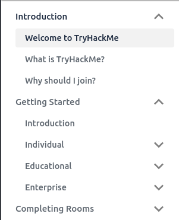

<h1 align="center">  
<br /><br />  
TryHackMe Documentation  
</h1>  
  
<p align="center">Officially maintained documentation for all TryHackMe products, services & resources.</p>  
  
<p align="center">  
 <span>
 <a href="https://travis-ci.com/github/tryhackmeltd/docs.tryhackme.com">
  </a>
  </span>
  
  <span>
  <a href="https://coveralls.io/github/tryhackmeltd/docs.tryhackme.com?branch=master">
  </a>
  </span>
  
  <span>
  <a href="#contributors-"><!-- ALL-CONTRIBUTORS-BADGE:START - Do not remove or modify this section -->

<!-- ALL-CONTRIBUTORS-BADGE:END -->
  </span>
  
  <span>
  <a href="https://github.com/tryhackmeltd/docs.tryhackme.com/issues">  
    </a>
  </span>
  
  <span>
   <a href="https://github.com/tryhackmeltd/docs.tryhackme.com/blob/master/LICENSE">  
    
  </a>
  </span>
</p>  
 
<p align="center">  
  <a href="https://docs.tryhackme.com" target="_blank">📚 Read the documentation</a>  
  |  
  <a href="#-contributing"><b>Contributing to the documentation</b></a>  
</p>  
  
<p>  
  <a aria-label="Follow @RealTryHackMe on Twitter" href="https://twitter.com/intent/follow?screen_name=realtryhackme">  
      
  </a>  
  <a aria-label="TryHackMe Blog" href="https://blog.tryhackme.com">  
      
  </a>  
</p>  
  
## Quick Links  
  
- [📚 Documentation](https://docs.tryhackme.com)  
- [👏 Contributing](#-contributing)  
- [❓ FAQ](#-faq)  
- [✨ Contributors](#contributors-)  
- [License](#license)  
  
## 📚 Documentation  
  
<p>The documentation can be accessed at <a aria-label="TryHackMe documentation" href="https://docs.tryhackme.com">https://docs.tryhackme.com</a>.</p>  
  
- [Cloning the repository for offline use](#-contributing)  
- [File a bug report](https://github.com/tryhackmeltd/docs.tryhackme.com/issues/new)  
- [Suggest a feature](https://github.com/tryhackmeltd/docs.tryhackme.com/issues/new)  
  
  
## 👏 Contributing  
  
If you like the TryHackMe documentation and want to help make it better then check out our guidelines below! If you are simply interested in adding a new article, amending an existing article, or fixing any grammatical/formatting errors, then you can follow the instructions below.  
  
> Note: in order to contribute to the project you must have **Node.js** & **NPM** installed. The Node.js binaries come with NPM bundled together, which can be downloaded at [https://nodejs.org/download](https://nodejs.org/download).  
  
#### 1. Clone repository and install dependencies  
You can execute the commands below into your local terminal window.  
```  
$ git clone https://github.com/tryhackmeltd/docs.tryhackme.com.git  
$ cd ./docs.tryhackme.com-master  
$ npm i  
```  
  
#### 2. Start development server to run locally  
Run the following in your local terminal window to start the local Node.js development server.   
*Ensure you are at the project's root directory (where package.json is located)*.  
```  
$ npm start  
```  
  
#### 3. Editing `<rootDir>/docs`  
All documentation markdown files (`*.md)`, which together make up the content visible on the TryHackMe documentation site can be found within `<rootDir>/docs`.

Directories are treated as categories, and the markdown files are treated as articles, each belonging to a category. As an example, take `docs/general/welcome`; the `general` directory contains multiple markdown files (articles), which are treated as all belonging to the category `general`, which is their parent directory.

If you're adding a new article and feel it can be placed in an existing category, simply create a new markdown file `My Article.md` and drop it in the relevant directory. You need to make sure that you add the following header to any markdown file you add:

```markdown
---  
id: article-id  
title: My Article Title  
sidebar_label: My Sidebar Label
---
``` 

As an example, let's say you want to add the article `My Awesome Room` to the existing category **Rooms**. First, you'd navigate to `<rootDir>/docs/rooms`. You are now in the **Rooms** category. Now, you'd create a markdown file in this directory called `My Awesome Room.md` and add the following header to the very top of the file:

```markdown
---  
id: my-awesome-room  
title: My Awesome Room 
sidebar_label: My Awesome Room 
---
```

| key            | description |
|---------------|---------------------------------------------------------------------------------------------------|
| id           | The article ID, ideally just a kebab-case version of the article's title, i.e.  `my-awesome-room` | 
| title         | The article's title, i.e. `My Awesome Room`                                                       |
| sidebar_label | The title displayed in the sidebar, either the same as title or a shorter alternative             |

Now, save your changes, and if running the local development server you should be able to directly navigate to the document passing the URI `docs/rooms/my-awesome-room`. Note how the `ID` property is treated as the resource URI.

On the left of the document, there is the documentation sidebar, which looks something like this:



In order to add your new article to this sidebar, open `<rootDir>/sidebars.js` and locate the **Rooms** category. Then add the article to the `items` list, like so:

```js
{
  type: 'category',
  label: 'Rooms',
  items: [
    'rooms/introduction-to-rooms',
    'rooms/room-difficulty-levels',
    'rooms/my-awesome-room' // ADD YOUR NEW ARTICLE REFERENCE HERE!
  ]
}
```

Once you are happy with your changes, save the file and re-visit the article in your browser. You will notice it should now appear on the sidebar! You can now open a pull-request to add your article to the live documentation site!

If you wish to create a new category, the process above is the same, except you add your articles to your newly created category directory! The only difference is you will need to create the category object within the `<rootDir>/sidebars.js`, rather than just appending the article to an existing one.

For example, let's say you wanted `My Awesome Room` to live inside a new **Misc** category, you'd create a directory called 
`misc` under `<rootDir>/docs/`, which would give you `<rootDir>/docs/misc`. Then, you'd add your `my-awesome-room.md` file inside this directory, ensuring you include the header as discussed before. Now, when editing `<rootDir>/sidebars.js`, you'd add a new object for the `misc` category, and then add your article as the first item in the `items` list, like so:

```js
{
  type: 'category',
  label: 'Rooms',
  items: [
    'rooms/introduction-to-rooms',
    'rooms/room-difficulty-levels',
    'rooms/my-awesome-room'
  ]
},

/**
* ADD NEW MISC CATEGORY
*/
{
  type: 'category',
  label: 'Misc',
  items: [
    'misc/my-awesome-room' // ADDED NEW CATEGORY AND ARTICLE!
  ]
}
```

Lastly, if you would like to display your category (*only for categories not articles*) on the homepage of the site, add your config object to `<rootDir/homepage-categories.js>`. Simply open the file and append your category to the end of the array, ensuring you bump the `id` up 1 from the previous item. To add the `misc` category, you'd add the following:


```js
module.exports = [
  {
    id: 1,
    title: 'Introduction',
    description: 'Just getting started with TryHackMe? Start here for a detailed introduction to our platform.',
    uri: '/docs/introduction/welcome'
  },
  {
    id: 2,
    title: 'What is TryHackMe?',
    description: 'Not entirely sure what TryHackMe is all about? This article will explain the core concepts behind what we offer.',
    uri: '/docs/introduction/what-is-tryhackme'
  },
  {
    id: 3,
    title: 'Why should I Join?',
    description: 'We know the reasons why you should join, but if you\'re still a bit sceptical then why not have a read.',
    uri: '/docs/introduction/why-should-i-join'
  },
  {
    id: 4,
    title: 'Getting Started',
    description: 'Want to get started with learning or teaching cyber security? This article is for you.',
    uri: '/docs/getting-started/introduction'
  },
  
  /**
  * ADDED THE MISC CATEGORY TO THE END OF THE LIST, INCREMENTING THE ID BY 1.
  */
  
  {
    id: 5,
    title: 'Misc',
    description: 'This is my new category that houses a lot of miscellaneous things.',
    uri: '/docs/misc/my-awesome-room' // THIS WILL BE THE URI TO THE FIRST ARTICLE IN THE CATEGORY, IN THIS CASE IT'S THE ONLY ARTICLE
  }

]
```

Once complete, commit your changes and open a pull request for us to review and merge.

> Note: although adding and amending documentation markdown files should not affect any of the pre-existing unit tests, please ensure you check this prior to raising a pull request. 
> 
> ***If you are making code edits, please ensure you update the relevant tests accordingly; including adding any tests to cover new functionality. Our TravisCI build expects 100% code coverage from Jest (with cirumstantial exceptions).***
  
## ❓ FAQ  
  
If you have questions about TryHackMe or this documentation and want answers, then check out our [Discord](https://discord.gg/VdCtjEg) or connect with us on [Twitter](https://twitter.com/RealTryHackMe) and [Instagram](https://instagram.com/RealTryHackMe)!  
  
Alternatively, you may also ask questions on our [forums](https://tryhackme.com/forum).  
  

## Contributors ✨

Thanks goes to these wonderful people ([emoji key](https://allcontributors.org/docs/en/emoji-key)):

<!-- ALL-CONTRIBUTORS-LIST:START - Do not remove or modify this section -->
<!-- prettier-ignore-start -->
<!-- markdownlint-disable -->
<table>
  <tr>
    <td align="center"><a href="https://twitter.com/Matt_Kent9"><br /><sub><b>Matt Kent</b></sub></a><br /><a href="#infra-Kent55" title="Infrastructure (Hosting, Build-Tools, etc)">🚇</a> <a href="https://github.com/tryhackmeltd/docs.tryhackme.com/commits?author=Kent55" title="Tests">⚠️</a> <a href="https://github.com/tryhackmeltd/docs.tryhackme.com/commits?author=Kent55" title="Code">💻</a> <a href="#design-Kent55" title="Design">🎨</a> <a href="https://github.com/tryhackmeltd/docs.tryhackme.com/commits?author=Kent55" title="Documentation">📖</a> <a href="https://github.com/tryhackmeltd/docs.tryhackme.com/issues?q=author%3AKent55" title="Bug reports">🐛</a> <a href="https://github.com/tryhackmeltd/docs.tryhackme.com/pulls?q=is%3Apr+reviewed-by%3AKent55" title="Reviewed Pull Requests">👀</a></td>
    <td align="center"><a href="https://twitter.com/0x8445"><br /><sub><b>Ben Spring</b></sub></a><br /><a href="https://github.com/tryhackmeltd/docs.tryhackme.com/commits?author=benspring" title="Code">💻</a> <a href="https://github.com/tryhackmeltd/docs.tryhackme.com/commits?author=benspring" title="Documentation">📖</a> <a href="#design-benspring" title="Design">🎨</a> <a href="https://github.com/tryhackmeltd/docs.tryhackme.com/pulls?q=is%3Apr+reviewed-by%3Abenspring" title="Reviewed Pull Requests">👀</a></td>
    <td align="center"><a href="http://muirlandoracle.co.uk"><br /><sub><b>MuirlandOracle</b></sub></a><br /><a href="https://github.com/tryhackmeltd/docs.tryhackme.com/commits?author=MuirlandOracle" title="Documentation">📖</a></td>
    <td align="center"><a href="https://cmnatic.co.uk"><br /><sub><b>Ben Eriksson</b></sub></a><br /><a href="https://github.com/tryhackmeltd/docs.tryhackme.com/commits?author=CMNatic" title="Documentation">📖</a></td>
    <td align="center"><a href="https://github.com/MichaelCoding25"><br /><sub><b>Michael Spector</b></sub></a><br /><a href="https://github.com/tryhackmeltd/docs.tryhackme.com/commits?author=MichaelCoding25" title="Documentation">📖</a></td>
    <td align="center"><a href="https://github.com/Swafox"><br /><sub><b>Swafox</b></sub></a><br /><a href="https://github.com/tryhackmeltd/docs.tryhackme.com/commits?author=Swafox" title="Documentation">📖</a></td>
    <td align="center"><a href="https://jc01.ninja/"><br /><sub><b>James</b></sub></a><br /><a href="https://github.com/tryhackmeltd/docs.tryhackme.com/commits?author=NinjaJc01" title="Documentation">📖</a> <a href="https://github.com/tryhackmeltd/docs.tryhackme.com/issues?q=author%3ANinjaJc01" title="Bug reports">🐛</a></td>
  </tr>
  <tr>
    <td align="center"><a href="https://github.com/VladBirgauanu"><br /><sub><b>Chevalier</b></sub></a><br /><a href="https://github.com/tryhackmeltd/docs.tryhackme.com/commits?author=VladBirgauanu" title="Documentation">📖</a> <a href="#security-VladBirgauanu" title="Security">🛡️</a></td>
    <td align="center"><a href="https://github.com/ashu-savani"><br /><sub><b>ashu-savani</b></sub></a><br /><a href="https://github.com/tryhackmeltd/docs.tryhackme.com/commits?author=ashu-savani" title="Documentation">📖</a></td>
    <td align="center"><a href="https://umair9747.github.io/"><br /><sub><b>Umair</b></sub></a><br /><a href="https://github.com/tryhackmeltd/docs.tryhackme.com/issues?q=author%3Aumair9747" title="Bug reports">🐛</a></td>
    <td align="center"><a href="https://github.com/ZultanH"><br /><sub><b>Zultan</b></sub></a><br /><a href="https://github.com/tryhackmeltd/docs.tryhackme.com/issues?q=author%3AZultanH" title="Bug reports">🐛</a></td>
    <td align="center"><a href="https://github.com/FreezeLuiz"><br /><sub><b>M. H.</b></sub></a><br /><a href="https://github.com/tryhackmeltd/docs.tryhackme.com/commits?author=FreezeLuiz" title="Documentation">📖</a></td>
    <td align="center"><a href="https://github.com/holmes-py"><br /><sub><b>Hardeep Singh</b></sub></a><br /><a href="https://github.com/tryhackmeltd/docs.tryhackme.com/commits?author=holmes-py" title="Documentation">📖</a></td>
    <td align="center"><a href="https://github.com/kaanis"><br /><sub><b>kaanis</b></sub></a><br /><a href="https://github.com/tryhackmeltd/docs.tryhackme.com/commits?author=kaanis" title="Documentation">📖</a> <a href="https://github.com/tryhackmeltd/docs.tryhackme.com/issues?q=author%3Akaanis" title="Bug reports">🐛</a></td>
  </tr>
  <tr>
    <td align="center"><a href="http://ag3n7.github.io"><br /><sub><b>ABHIJITH P K</b></sub></a><br /><a href="https://github.com/tryhackmeltd/docs.tryhackme.com/issues?q=author%3Aag3n7" title="Bug reports">🐛</a></td>
    <td align="center"><a href="https://skerritt.blog"><br /><sub><b>Bee</b></sub></a><br /><a href="https://github.com/tryhackmeltd/docs.tryhackme.com/commits?author=bee-san" title="Documentation">📖</a></td>
    <td align="center"><a href="https://github.com/ariyonaty"><br /><sub><b>Ari Yonaty</b></sub></a><br /><a href="https://github.com/tryhackmeltd/docs.tryhackme.com/issues?q=author%3Aariyonaty" title="Bug reports">🐛</a></td>
    <td align="center"><a href="https://github.com/tkolstee"><br /><sub><b>Tony Kolstee</b></sub></a><br /><a href="https://github.com/tryhackmeltd/docs.tryhackme.com/commits?author=tkolstee" title="Documentation">📖</a></td>
    <td align="center"><a href="http://Shubhank.netlify.app"><br /><sub><b>Shubh4nk</b></sub></a><br /><a href="https://github.com/tryhackmeltd/docs.tryhackme.com/commits?author=5h0bh4nk" title="Documentation">📖</a></td>
  </tr>
</table>

<!-- markdownlint-restore -->
<!-- prettier-ignore-end -->

<!-- ALL-CONTRIBUTORS-LIST:END -->

This project follows the [all-contributors](https://github.com/all-contributors/all-contributors) specification. Contributions of any kind welcome!
  
## License  
  
The TryHackMe documentation source code is boilerplated from the Docusaurus OSS, and is made available under the [MIT license](LICENSE). Please check nested dependencies for their relevant licenses; some may be BSD etc.  
  
<!-- Footer -->  
  
---  
  
<p>  
<center>
    <a aria-label="TryHackMe documentation source is free to use" href="https://github.com/tryhackmeltd/docs.tryhackme.com/blob/master/LICENSE" target="_blank">  
          
    </a>
    </center>  
</p>
